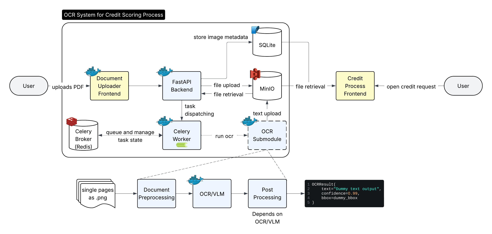

# OCR Module

This is a standalone OCR microservice designed to run as a container.



## Architecture

- Exposes a FastAPI service
- Accepts image uploads for OCR
- Returns structured OCR results
- Designed with a pluggable engine interface

## Interfaces

- Module Input: file folder with multiple images (pages as .png)
- OCR Input: `image/png` (one single page) for OCR
- Output: JSON containing OCR text, bounding boxes, and confidence scores.

## Prerequisites

Before using this project, make sure you have the following installed:

### Required

- **Docker Desktop**
  - [Install Guide](https://docs.docker.com/get-started/get-docker/)

- Docker daemon running (test with `docker info`)

### Optional (for testing locally without Docker)

- Python 3.10+ (if you want to run tests manually)
- `poppler-utils` and dependencies for `pdf2image`

## Development

### 1. Build the Docker image

```bash
docker build --no-cache -t ocr-module .
```

### 2. Run the **FastAPI server** (default)

This uses `uvicorn` to start the API (based on `ENTRYPOINT` in your Dockerfile):

```bash
docker run --rm -p 8080:8080 ocr-module
```

You can now `POST` a PNG to:

* `http://localhost:8080/ocr/` → for OCR
* `http://localhost:8080/vlm_extract/` → for dummy VLM (if enabled)
* `http://localhost:8080/health` → health check

## 3. Run the **local test runner** (from PDF to JSON)

> This bypasses the FastAPI app and runs `tests/local_test.py`, with mounted input/output folders under `tmp/`.

**Required:**

* A PDF must be placed in `tmp/input_pdf/` before running.
* The container will convert PDF to PNGs and output JSONs to `tmp/output/`.

**Command:**

```bash
docker run --rm \
  -v "$PWD/tmp:/app/tmp" \
  -e PYTHONPATH=/app \
  -e RUN_LOCAL_TEST=1 \
  --entrypoint python \
  ocr-module \
  tests/local_test.py
```

### What this setup gives you

| Use Case       | Command                                                                                                                            |
| -------------- | ---------------------------------------------------------------------------------------------------------------------------------- |
| Run API server | `docker run --rm -p 8080:8080 ocr-module`                                                                                          |
| Run local test | `docker run --rm -v "$PWD/tmp:/app/tmp" -e PYTHONPATH=/app -e RUN_LOCAL_TEST=1 --entrypoint python ocr-module tests/local_test.py` |

Let me know if you want to define a Makefile or Docker Compose for this – but as-is, you’re clean.

## ToDo

### 1. Pre- and Post-Processing Pipelines

* [ ] Add image-deskew step before OCR
* [ ] Apply adaptive thresholding, binarization and denoise filters
* [ ] Detect and correct page orientation (portrait ↔ landscape)
* [ ] Auto-tune DPI based on page dimensions (e.g. switch between 150 dpi and 300 dpi)

### 2. Multi-Engine Ensemble

* [ ] Integrate at least two additional OCR backends (Tesseract, TrOCR, PaddleOCR)
* [ ] Implement line-matching across engines (e.g. via IoU or text similarity)
* [ ] Merge overlapping outputs by confidence-weighted voting
* [ ] Add fallback logic: reroute problematic regions to the most accurate engine

### 3. Layout Analysis

* [ ] Plug in a Detectron2/PubLayNet model to segment text, tables, figures
* [ ] Split multi-column regions along whitespace gaps
* [ ] Dispatch “table” regions to table extractor and “text” regions to OCR
* [ ] Emit structural JSON: pages → regions → lines → words

### 4. Quality Metrics & Automatic QA

* [ ] Compute per-block `needs_review` via confidence < 0.70 and gibberish filters
* [ ] Add language detection and readability checks to drop nonsense
* [ ] Flag cross-engine disagreement and run secondary engine on medium-risk pages
* [ ] Calculate page-risk score and mark high-risk pages for review

### 5. Schema Validation & Versioning

* [ ] Define JSON Schema for page files with `schema_version`, `page`, `size`, `items`
* [ ] Integrate runtime schema validator into the pipeline
* [ ] Auto-bump `schema_version` in CI when output format changes
* [ ] Publish schema as `ocr.schema.json` in the repo root

### 6. Plugin Architecture & Configurable Pipelines

* [ ] Refactor engine loading to use setuptools entry-points (`ocr_engines` group)
* [ ] Support YAML/JSON config for engines, thresholds, pre/post steps
* [ ] Expose a single `run_pipeline(config_path)` API from CLI and Python
* [ ] Document all config options and sensible defaults

### 7. REST/gRPC Wrappers & Client-Side Helpers

* [ ] Add a minimal FastAPI wrapper with OpenAPI schema
* [ ] Provide a Dockerfile to run the service container
* [ ] Ship a tiny JS snippet that draws SVG boxes + confidence heatmap
* [ ] Publish the JS as an NPM package

### 8. Developer Experience (Docs, Tests, Packaging)

* [ ] Create Sphinx-powered docs site with getting-started guide and API reference
* [ ] Write unit tests for helpers and CI integration tests with sample PDFs
* [ ] Add `mypy`, `flake8`, `black` checks and pre-commit hooks
* [ ] Publish to PyPI with semantic versioning and maintain `CHANGELOG.md`

### 9. Telemetry & Observability

* [ ] Instrument core steps with Prometheus metrics (pages/sec, error rates)
* [ ] Switch logging to structured JSON for easier parsing
* [ ] Expose a `/metrics` endpoint in the HTTP wrapper
